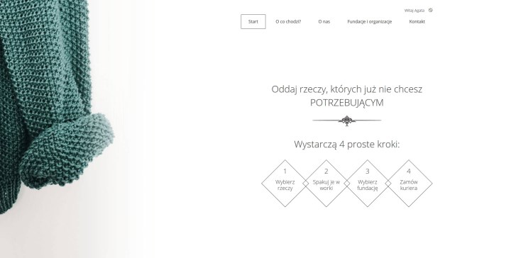
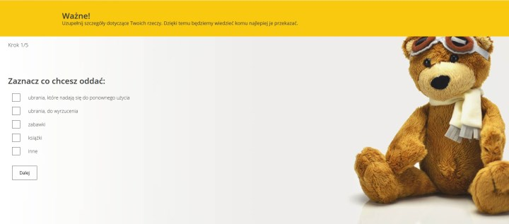
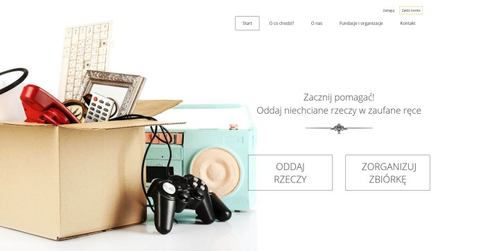
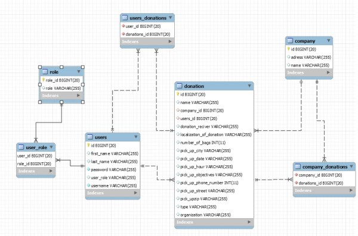

# GiveBack
WebApp where you can donate your clothes or other stuff to non profit organizations.

##Used Technologies:

1. Java
1. Spring
1. Spring Boot
1. Spring Security
1. Hibernate
1. JSP
1. Java Script
1. CSS
1. HTML

##Functionality:

 - Registration and login forms,
 - Separate dashboard for user and administrator (work in progress)
 - Donation form including which organization to donate.
 
 
 
 
 ## Upgrade plans:
 
  - Add e-mail notifications with informations about date and time of pick up donation,
  - Create better front-end for administrator dashboard.
  
  ## Data Base structure (probably not final)
  
  
 
